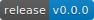

# go-editor

Allow your CLI users to edit arbitrary data in their preferred editor.

Just like editing messages in `git commit` or resources with `kubectl edit`.

## Install

    go get github.com/codyaray/go-editor

## Usage

### Basic Usage

Provide any `io.Reader` with the initial contents:

	original := bytes.NewBufferString("something to be edited\n")

	edit := editor.NewEditor()
	edited, path, err := edit.LaunchTempFile("example", original)
	defer os.Remove(path)
	if err != nil {
	    // handle it
	}

The library leaves it up to you to cleanup the temp file. For example, this
allows your CLI to validate the edited data and prompt the user to continue
editing where they left off, rather than starting their changes over.

You can see working examples in the [examples](./examples) directory.

### Input Validation

If you would like to validate the edited data, use a `ValidatingEditor` instead:

    schema := &mySchema{}
    edit := editor.NewValidatingEditor(schema)

A schema is any object that implements the [Schema](./interfaces.go) interface.
This interface has a single method, `ValidateBytes([]byte) error`.

You can see working examples in the [examples](./examples) directory.

Happy editing!

## Acknowledgements

Thanks to these other projects and groups for pointing the way.

* [kubernetes/kubernetes](https://github.com/kubernetes/kubernetes)
* [AlecAivazis/survey](https://github.com/AlecAivazis/survey)
* [golang/nuts](https://groups.google.com/forum/#!topic/golang-nuts/cuAEvgqqYFU)
